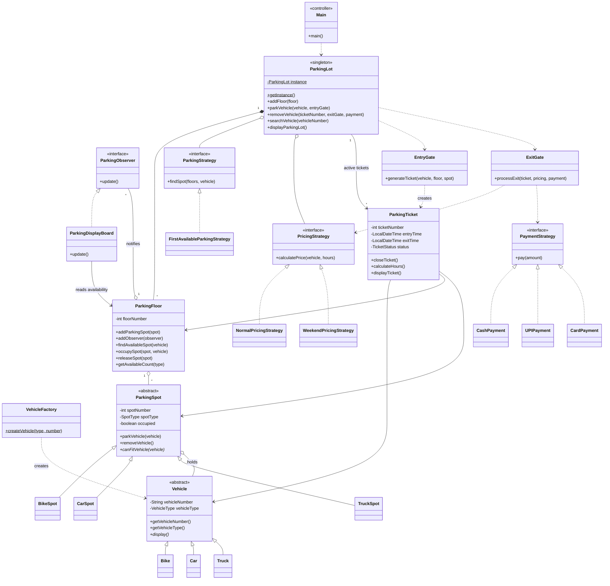

# ParkEngine-Parking-Allocation-System
Scalable parking allocation system in Java using Singleton, Factory, Observer and Strategy design patterns.

# Parking System (Java)

A console-based (CUI) parking lot system built in Java to demonstrate object-oriented design and design patterns. Vehicles enter through an entry gate and receive a ticket. At the exit gate the ticket is closed, the charges are calculated, and payment is collected.

## Features
- Entry gate: collects the vehicle type and number, allocates a spot, and issues a ticket
- Exit gate: closes the ticket, calculates charges, and collects payment (Cash / UPI / Card)
- Duplicate protection: a vehicle number that is already parked cannot be parked again
- Search a parked vehicle by its number
- Live display board for each floor that shows available spots
- 2 floors, each with 2 Bike, 2 Car and 2 Truck spots (small numbers chosen for easy understanding)
- Parking charged per hour, rounded up, with a minimum of 1 hour

## Tech Stack
- Java 8 or higher
- Console application (single-threaded)

## Design Patterns Used
| Pattern   | Where                                                      | Purpose                                                           |
|-----------|------------------------------------------------------------|-------------------------------------------------------------------|
| Singleton | `ParkingLot`                                               | Only one parking lot instance exists in the system                |
| Factory   | `VehicleFactory`                                           | Creates the correct `Bike`, `Car` or `Truck` object               |
| Observer  | `ParkingFloor` (subject), `ParkingDisplayBoard` (observer) | Display board updates automatically when spots are taken or freed |
| Strategy  | `ParkingStrategy`, `PricingStrategy`, `PaymentStrategy`    | Spot selection, pricing and payment methods can be swapped        |
|           |                                                            | without changing the core logic                                   |

## OOP Concepts Used
- **Abstraction and inheritance:** `Vehicle` and `ParkingSpot` are abstract parents with concrete children
- **Polymorphism:** `canFitVehicle()` and `display()` are overridden by each subclass
- **Encapsulation:** private fields with getters
- **Composition:** a `ParkingSpot` holds a `Vehicle`, a `ParkingTicket` holds a vehicle, floor and spot

## Class Diagram

*Enums: `VehicleType`, `SpotType`, `TicketStatus`.*

## Project Structure
```
parking-system-java/
├── README.md
├── .gitignore
└── src/
    ├── Main.java                  (menu / controller)
    ├── VehicleType.java, SpotType.java, TicketStatus.java      (enums)
    ├── Vehicle.java, Bike.java, Car.java, Truck.java
    ├── VehicleFactory.java
    ├── ParkingSpot.java, BikeSpot.java, CarSpot.java, TruckSpot.java
    ├── ParkingObserver.java, ParkingDisplayBoard.java
    ├── ParkingFloor.java
    ├── ParkingStrategy.java, FirstAvailableParkingStrategy.java
    ├── PricingStrategy.java, NormalPricingStrategy.java, WeekendPricingStrategy.java
    ├── PaymentStrategy.java, CashPayment.java, UPIPayment.java, CardPayment.java
    ├── ParkingTicket.java
    ├── EntryGate.java, ExitGate.java
    └── ParkingLot.java
```

## How to Run
```bash
git clone https://github.com/Shreya-P-Pasalkar/parking-system-java.git
cd parking-system-java
javac src/*.java
java -cp src Main
```

## Sample Output
```
------------------------------------------------------------------
---------------------- Marvellous ParkEngine ---------------------
------------------------------------------------------------------
1 : Park Vehicle
2 : Exit Vehicle
3 : Search Vehicle
4 : Display Parking Lot
5 : Exit
Enter your choice :
```

## Pricing (per hour, rounded up, minimum 1 hour)
| Vehicle | Normal | Weekend |
|---------|--------|---------|
| Bike    | Rs. 20  | Rs. 40  |
| Car     | Rs. 50  | Rs. 100 |
| Truck   | Rs. 100 | Rs. 200 |

`WeekendPricingStrategy` is implemented and can be activated with `setPricingStrategy()`. The menu uses normal pricing by default.

## Assumptions and Limitations
- Single-threaded, one entry gate and one exit gate
- Data is stored in memory only and is lost when the program closes
- Vehicle numbers are case-sensitive

## Future Improvements
- Store data in a file or database
- Add multiple gates with multithreading
- Add `NearestAvailableParkingStrategy` and a menu option for weekend pricing
- Build a GUI version

## Author
Shreya Pasalkar